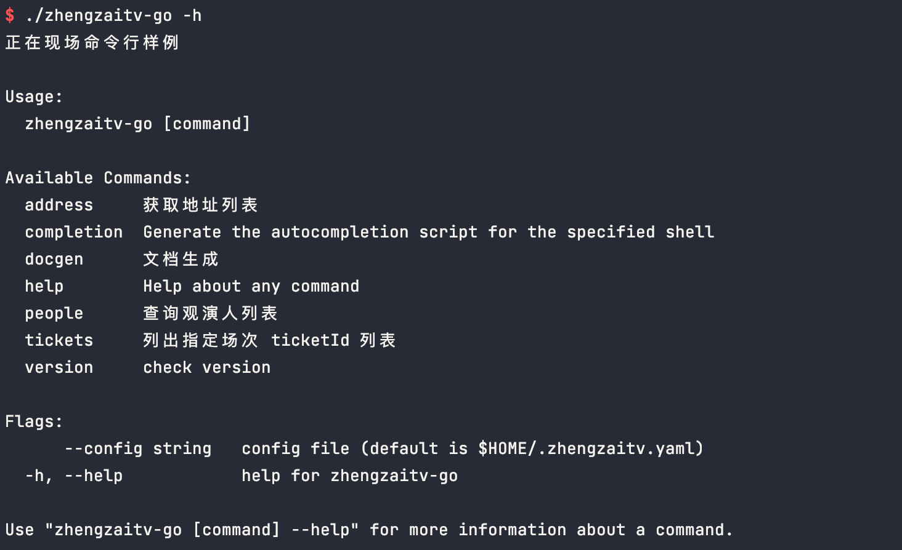

<!-- START doctoc generated TOC please keep comment here to allow auto update -->
<!-- DON'T EDIT THIS SECTION, INSTEAD RE-RUN doctoc TO UPDATE -->
**Table of Contents**  *generated with [DocToc](https://github.com/thlorenz/doctoc)*

- [zhengzaitv-go](#zhengzaitv-go)
- [usage](#usage)
- [免责声明](#%E5%85%8D%E8%B4%A3%E5%A3%B0%E6%98%8E)
- [acknowledgement](#acknowledgement)

<!-- END doctoc generated TOC please keep comment here to allow auto update -->

### zhengzaitv-go

> 正在现场请求样例学习。

### usage

- 下载对应 [release](https://github.com/ronething/zhengzaitv-go/releases) 即可

- 如果你需要手动编译 可以考虑执行以下命令

```shell
git clone https://github.com/ronething/zhengzaitv-go.git && cd zhengzaitv-go
go mod tidy && go build
```



命令行工具提供几个示例

- 查询观演人列表
- 列出指定场次票种列表
- 获取地址列表

场次 id 通常可以在 url 中看到 `/ticket/detail?id=11525xxxxx2714`

修改 `cli.yaml` 中的 cookies 为对应的 cookies 值

```shell
./zhengzaitv-go tickets -a 11525xxxxx2714 --config cli.yaml
./zhengzaitv-go people --config cli.yaml
./zhengzaitv-go address --config cli.yaml
```

PS: 目前不考虑提供 `order` 命令，只是提供一点思路，仅供研究学习，祝大家好运~

### 免责声明

本仓库发布的 `zhengzaitv-go` 项目中涉及的任何脚本，仅用于测试和学习研究，禁止用于商业用途，不能保证其合法性，准确性，完整性和有效性，请根据情况自行判断。

本项目内所有资源文件，禁止任何公众号、自媒体进行任何形式的转载、发布。

本人对任何脚本问题概不负责，包括但不限于由任何脚本错误导致的任何损失或损害.

间接使用脚本的任何用户，包括但不限于建立 VPS 或在某些行为违反国家/地区法律或相关法规的情况下进行传播, 本人对于由此引起的任何隐私泄漏或其他后果概不负责。

请勿将 `zhengzaitv-go` 项目的任何内容用于商业或非法目的，否则后果自负。

如果任何单位或个人认为该项目的脚本可能涉嫌侵犯其权利，则应及时通知并提供身份证明，所有权证明，我们将在收到认证文件后删除相关脚本。

以任何方式查看此项目的人或直接或间接使用 `zhengzaitv-go` 项目的任何脚本的使用者都应仔细阅读此声明。本人 保留随时更改或补充此免责声明的权利。
一旦使用并复制了任何相关脚本或 `zhengzaitv-go` 项目，则视为您已接受此免责声明。

您必须在下载后的24小时内从计算机或手机中完全删除以上内容。

本项目遵循 `GPL-3.0 License` 协议，如果本特别声明与 `GPL-3.0 License` 协议有冲突之处，以本特别声明为准。

> 您使用或者复制了本仓库且本人制作的任何代码或项目，则视为已接受此声明，请仔细阅读
您在本声明未发出之时点使用或者复制了本仓库且本人制作的任何代码或项目且此时还在使用，则视为已接受此声明，请仔细阅读

### acknowledgement

- zhengzai.tv